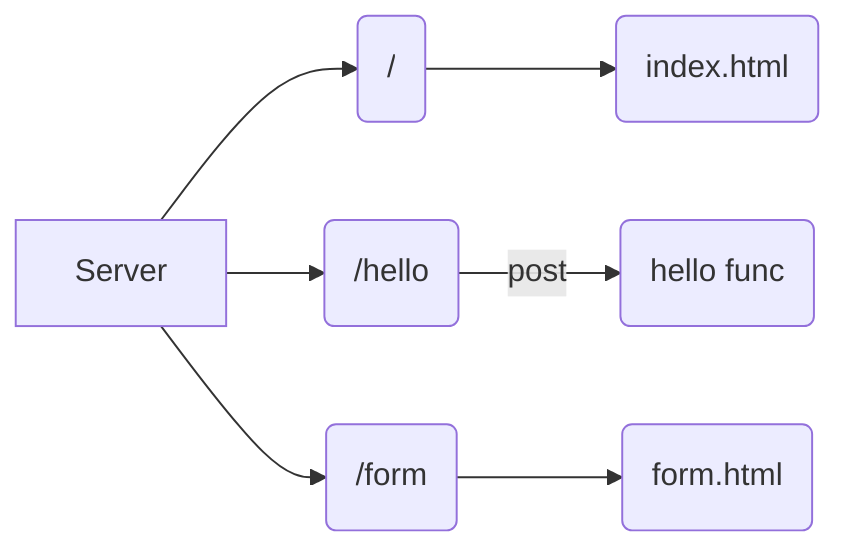

# go-server
go server inspired by free code camp 11 in 1 golang tute https://www.youtube.com/watch?v=jFfo23yIWac

## instructions for running locally 

```
 go build -buildvcs=false
 go run main.go
```


:white_check_mark: flowchart from the tutorial recreated in mermaid.js 

This cheatsheet was exceptionally helpful https://jojozhuang.github.io/tutorial/mermaid-cheat-sheet/



Mermaid Site 

- https://mermaid.live/
- https://mermaid-js.github.io/mermaid/#/


Other interesting resources
- https://github.blog/2022-02-14-include-diagrams-markdown-files-mermaid/
- https://docs.gitlab.com/ee/user/markdown.html#mermaid
- https://www.kubernetes.dev/blog/2021/12/01/improve-your-documentation-with-mermaid.js-diagrams/
- https://kubernetes.io/docs/contribute/style/diagram-guide/
