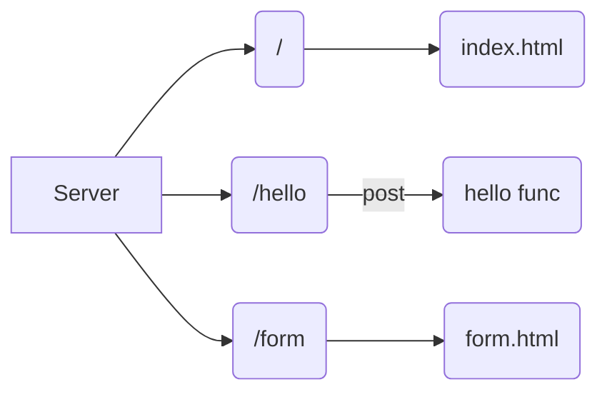

# go-server
go server inspired by free code camp 11 in 1 golang tute https://www.youtube.com/watch?v=jFfo23yIWac

## instructions for running locally 

```
 go build -buildvcs=false
 go run main.go
```


:white_check_mark: flowchart from the tutorial recreated in mermaid.js 

This cheatsheet was exceptionally helpful https://jojozhuang.github.io/tutorial/mermaid-cheat-sheet/

