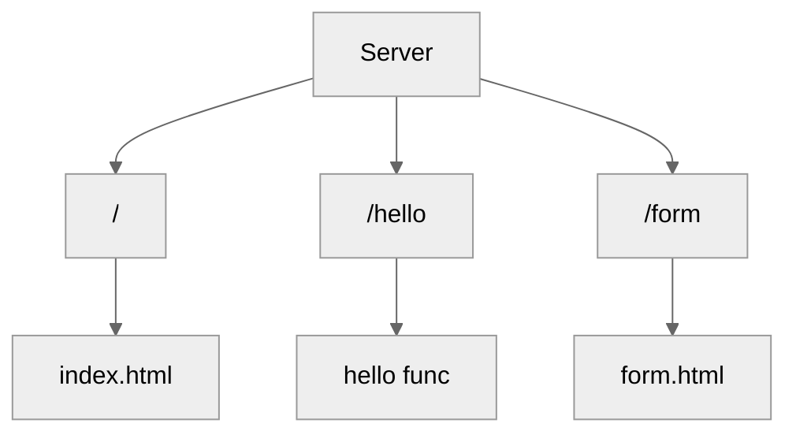

# go-server
go server inspired by free code camp 11 in 1 golang tute https://www.youtube.com/watch?v=jFfo23yIWac

## instructions for running locally 

```
 go build -buildvcs=false
 go run main.go
```


next steps - create the flowchart from the tutorial in mermaid.js and embed in this readme

